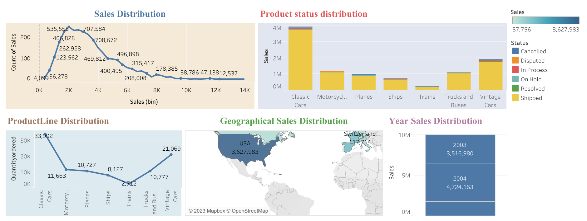

<h1 style='color:orange'>Sales Data analysis suing SQL and RFM analysis 📃✨</h1>


<h2 style='color:blue'>Table of Contents  📋 </h2>

- [Introduction](#introduction)
- [Installation](#installation)
- [Usage](#usage)
- [RFM Analysis](#rfm-analysis)
- [Analysis](#analysis)
- [Dashboard](#dashboard)
- [Contributing](#contributing)
- [License](#license)

## 📖 Introduction

In today's data-driven world, businesses heavily rely on analyzing sales data to make informed decisions and optimize their operations an maintain good relation with customers. This repository serves as a guide to leverage the power of SQL and RFM analysis to gain valuable insights from sales data. SQL (Structured Query Language) is a powerful tool for managing and querying relational databases, while RFM analysis is a technique used to segment customers based on their purchasing behavior. Here we will be using SQL to extract data from a database and perform RFM analysis to segment customers based on their purchasing behavior and identify the most valuable customers.

## 📦 Installation 

To get started with the sales data analysis project, follow these steps:

1. Clone the repository:

   ```bash
    git clone https://github.com/bharathguntreddi3/RFM-sales-analysis.git
    cd RFM-sales-analysis
    ```
2. Open RFM_sales.sql file in SQL server or your SQL development kit.

3. Add the Dataset 'sales_data.csv' to the database and run the code.

## 🚀 Usage 

To perform sales data analysis using SQL and RFM analysis, follow these steps:

1. Open your preferred SQL client and connect to the database where you imported the sales data.

2. Explore the provided SQL scripts in the repository. These scripts cover various aspects of sales data analysis, such as data cleaning, segmentation, and RFM analysis.

3. Execute the SQL queries in your SQL client to perform the desired analysis.

4. Analyze the results and gain insights from the sales data.

## 📊 RFM Analysis 

RFM analysis is a technique used to segment customers based on their purchasing behavior. It involves evaluating three key dimensions:

* <b>Recency(R):</b> Measures the time elapsed since the customer's last purchase. Customers who made recent purchases are more likely to be engaged and responsive.
* <b>Frequency(F):</b> Measures the number of purchases made by a customer over a specific period. Frequent customers are often more valuable to the business.
* <b>Monetary Value(M):</b> Measures the total value of purchases made by a customer. Customers with higher monetary value contribute more to the business revenue.

By analyzing these dimensions, RFM analysis assigns scores to each customer and categorizes them into different segments, such as:

* <b>High-Value Customers:</b> Customers with high RFM scores, indicating recent, frequent, and high-value purchases. These customers are crucial for business growth and should be retained.
* <b>Low-Value Customers:</b> Customers with low RFM scores, indicating infrequent, low-value purchases. Strategies should be developed to convert them into high-value customers or determine if they are worth retaining.
* <b>Churned Customers:</b> Customers who haven't made purchases for a long time. Identifying these customers can help in implementing targeted re-engagement strategies.

RFM analysis provides a powerful framework for understanding customer behavior and tailoring marketing strategies accordingly.

## 📈 Analysis

Here are a few examples of the analysis you can perform using this repository:

* Calculate the total revenue for a specific time period or for each month.
* Identify the top-selling products or categories.
* Segment customers based on their RFM scores and views.
* Analyze customer retention and churn rates.
* Identify high-value or best customers based on RFM analysis. 

Feel free to explore the repository and customize the SQL queries according to your specific requirements.

## 📊 Dashboard

Here is a preview of the interactive dashboard created using Tableau:



### Find the Live Dashboard [here](https://public.tableau.com/app/profile/guntreddi.bharath/viz/RFM_MetricSales/RFM_Sales_1?publish=yes)

## 🤝 Contributing

Contributions to this repository are welcome! If you have any ideas, suggestions, or improvements, please follow these steps:
1. Fork the repository.

2. Create a new branch.

    ```bash
        git checkout -b feature/your-feature
    ```
3. Make your changes and commit them.

    ```bash
        git commit -m 'Add some feature'
    ```
4. Push your changes to your forked repository.

    ``bash
        git push origin feature/your-feature
    ```
5. Open a pull request.

Once your pull request is submitted, it will be reviewed, and any necessary feedback or changes will be communicated.

## 📄 License
This project is licensed under the [MIT License](LICENSE). Feel free to use, modify, and distribute the code as per the terms of the license.

I hope this repository helps you gain valuable insights from your sales data using SQL and RFM analysis. If you have any questions or need further assistance, please feel free to open an issue. Happy analyzing!

If you find this project interesting and useful, show your support by starring ⭐ the repository and sharing it with others. Let's revolutionize productivity together!

## If any necessary commits are required to increase the elegance of this repo! i'm always open for a PR.

## With this signing off..!!, BHARATH GUNTREDDI ..🤞

